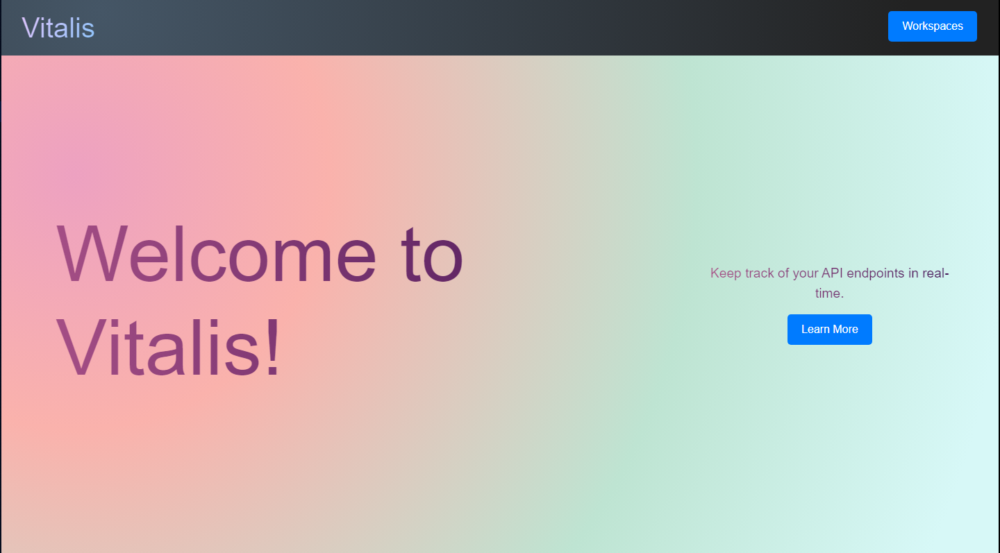
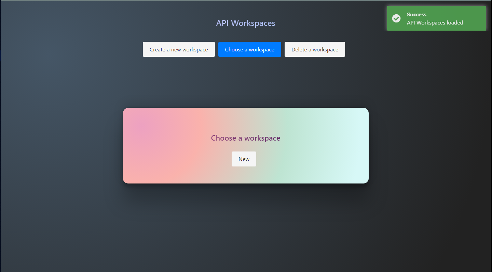
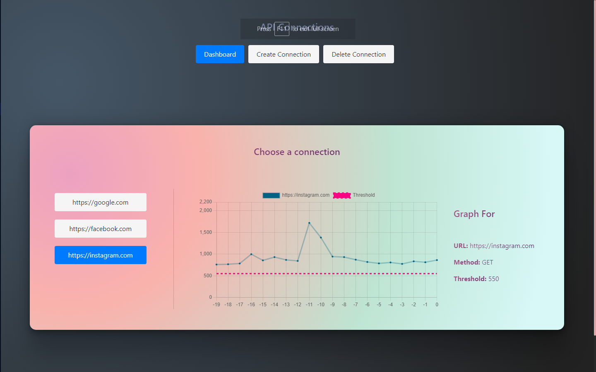

# Vitalis - A Server Health Monitoring Application



## About

The Server Health Monitoring Application is a full-stack application built using React, Node.js, MongoDB, and Redis. It allows users to monitor the response times of multiple servers in real-time. The application is containerized and orchestrated using Docker Compose, making it easy to deploy and manage.

## File Structure

```
server-health-monitoring/
|-- client/ # React frontend (Client)
|-- screenshots/ # Screenshots of the application
|-- server/ # Node.js backend (Server)
|-- .env.example/ # Example environment variables
|-- .gitignore
|-- docker-compose.yml/ # Docker Compose configuration file
|-- LICENSE
|-- README.md
|-- remote-server.example.yml/ # Example docker compose configuration file for remote servers
```

## Requirements

To run the Server Health Monitoring Application, you will need the following tools and technologies installed on your system:

1. [Docker](https://www.docker.com/get-started) - For containerization of microservices.
2. [Docker Compose](https://docs.docker.com/compose/install/) - To define and manage multi-container Docker applications.

## Installation

To run the Server Health Monitoring Application locally, make sure you have Docker and Docker Compose installed on your system. Then, follow these steps:

1. Clone this repository:

```
git clone https://github.com/your-username/server-health-monitoring.git
```

```
cd server-health-monitoring
```

2. Create a `.env` file in the root directory and add the environment variables as shown in the `.env.example` file.

3. Build the Docker images and start the containers:

```
docker-compose up -d
```

4. The application will be available at:

   - Frontend (React) - http://localhost:1234

5. In case of a remote server, you will need to install Docker and Docker Compose on the remote server, you need to pull custom images from Docker Hub, and you need to run the containers using the `docker-compose.yml` file. You can use the `remote-server.example.yml` file as a reference.

## Screenshots




## Video

[](https://youtu.be/KTq7uREEqK0)

## License

This project is licensed under the [GNU General Public License v3.0](LICENSE).

## Author

This Server Health Monitoring Application was created by [@sbk2k1](https://github.com/sbk2k1).

If you have any questions or feedback, feel free to reach out!
